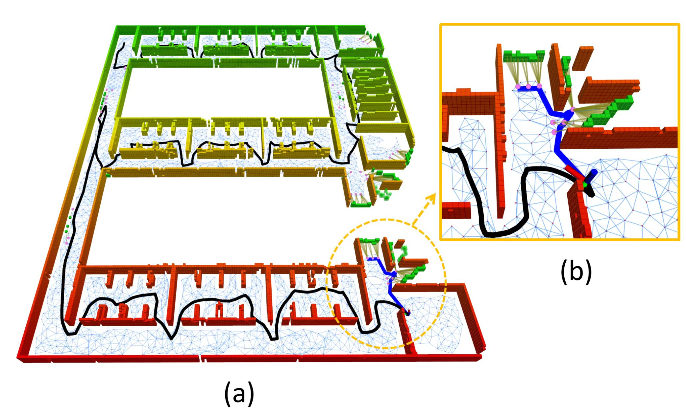
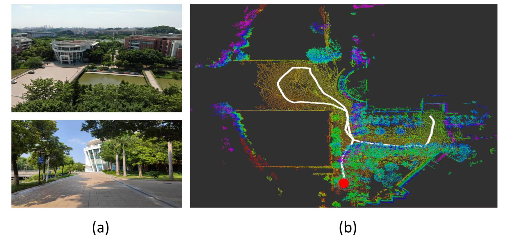

# FAEL

**FAEL** is a systematic framework for **F**ast **A**utonomous **E**xploration for **L**arge-scale environment. In **FAEL**, a fast preprocessing of environmental information is presented, providing fundamental information to support high-frequency path planning. An path optimization formulation that comprehensively considers key factors about fast exploration is introduced. Further, an heuristic algorithm is devised to solve the NP-hard optimization problem, which empirically finds optimal solution in real time. Our method is demonstrated to completes exploration with the least time and shortest movement distance compared to state-of-the-art methods at the time of publication.

<p align="center">
  
  
</p>

__Real-world experiment video__: [video](https://www.bilibili.com/video/BV1rv4y1i7Sg/?spm_id_from=333.999.0.0&vd_source=4b11429ea8ba8725f0fc457cc4442883)

__Contributors__: Junlong Huang, [Boyu Zhou](http://boyuzhou.net), Zhengping Fan, Yilin Zhu, Yingrui Jie, Longwei Li and [Hui Cheng](https://cse.sysu.edu.cn/content/2504) from [SYSU RAPID Lab](http://lab.sysu-robotics.com/index.html).

__Related Papers__:   
- Junlong Huang, Boyu Zhou, Zhengping Fan, Yilin Zhu, Yingrui Jie, Longwei Li, Hui Cheng*, [__FAEL: Fast Autonomous Exploration for Large-Scale Environments with a Mobile Robot__](https://ieeexplore.ieee.org/document/10015689), IEEE Robotics and Automation Letters, vol. 8, no. 3, pp. 1667-1674, March 2023

Please cite our paper if you use this project in your research:
```
@article{10015689,
  author={Huang, Junlong and Zhou, Boyu and Fan, Zhengping and Zhu, Yilin and Jie, Yingrui and Li, Longwei and Cheng, Hui},
  journal={IEEE Robotics and Automation Letters}, 
  title={FAEL: Fast Autonomous Exploration for Large-scale Environments With a Mobile Robot}, 
  year={2023},
  volume={8},
  number={3},
  pages={1667-1674},
  doi={10.1109/LRA.2023.3236573}}
```

## Index

- [FAEL](#fael)
  - [Index](#index)
  - [Prerequisites](#prerequisites)
  - [Build FAEL on ROS](#build-fael-on-ros)
  - [Run FAEL in simulation](#run-fael-in-simulation)
  - [Exploring Different Environments](#exploring-different-environments)
  - [Known issues](#known-issues)
    - [Degradation of exploratory performance](#degradation-of-exploratory-performance)
  - [Acknowledgements](#acknowledgements)

## Prerequisites
1. This project has been tested on __Ubuntu 20.04(ROS Noetic)__, run the following commands to install required tools:
```bash
sudo apt-get install ros-noetic-navigation \
ros-noetic-gazebo-* \
ros-noetic-gazebo-ros-control* \
ros-noetic-controller-* \
ros-noetic-tf2-* \
ros-noetic-octomap-* \
ros-noetic-velodyne-* \
ros-noetic-pointgrey-camera-description \
ros-noetic-twist-mux \
ros-noetic-teleop-twist-joy \
ros-noetic-lms1xx \
ros-noetic-interactive-marker-twist-server \
libgoogle-glog-dev \
libignition-common3-graphics-dev \
libignition-common3-profiler-dev \
python3-tk 
```

2. Before running FAEL, we recommend that you download [gazebo_models](https://github.com/osrf/gazebo_models) in advance, and put them in directory `~/.gazebo/models`.

## Build FAEL on ROS
Then simply clone and compile our package (using ssh here):
```bash
cd ${YOUR_WORKSPACE_PATH}/src
git clone git@github.com:SYSU-RoboticsLab/FAEL.git
cd ../ 
catkin_make
```

## Run FAEL in simulation
After compilation you can start a sample exploration demo. You need to open 3 terminals at the same time, and run the following 3 commands in sequence.

- Open the simulation environment in the first terminal:
```bash
source devel/setup.bash && roslaunch exploration_manager sim_env.launch
```
- Run the local_planner in the second terminal:
```bash
source devel/setup.bash && roslaunch exploration_manager robot_move.launch
```
- Start the exploration in the third terminal:
```bash
source devel/setup.bash && roslaunch exploration_manager explorer.launch
```
By default you can see an outdoor environment **scene_1.world**. The mobile robot will automatically start exploring after the file `explorer.launch` is run.

## Exploring Different Environments
The exploration environments in our simulator are represented by `*.world` files. We provide some simulation environments in package `sim_env`, which can be selected in `sim_env.launch`, and you also need to select the corresponding parameter **map_area** in `visualization_tools.launch`. The corresponding relationship is as follows:
* scene_1.world : 4582
* scene_2.world : 4146
* scene_3.world : 9601
* scene_4.world : 12129

## Known issues
***Noted:*** __If you find any other problem, please point it out and we will try our best to address it.__

### Degradation of the point cloud in simulation

If you find that the planned path is obviously weird and the exploration efficiency drops significantly compared with our paper, it is possibly caused by the degradation of the point cloud. In this case, we recommend that you use a discrete graphics card or a better discrete graphics card.

__*Noted:*__ We assume that there are 2 graphics cards (**integrated graphics card** and **discrete graphics card**) on your computer.   
As we use GPU for Velodyne VLP-16 LiDAR in simulation, if you use the integrated graphics card on ubuntu, the point cloud of Lidar would degrade, resulting in failed exploration. To address this problem, we recommend that you switch to discrete graphics card. Take **Intel Graphics Card** and **Nvidia Graphics Card** as an example here.

1. Install Nvidia Graphics Card Driver

Open up a new terminal window and enter the following command to see which driver is **recommended** for your specific card.
```bash
ubuntu-drivers devices
```

Take `nvidia-driver-470` as an example, enter the following command to install.
```bash
sudo apt-get install nvidia-driver-470
```

2. Switch to Nvidia Graphics Card
```bash
sudo prime-select nvidia
sudo reboot
```

## Acknowledgements
We use [jackal](https://github.com/jackal) for ground robot simulation, [RotorS](https://github.com/ethz-asl/rotors_simulator) for generic odometry sensor simulation, [cmu_planner](https://github.com/jizhang-cmu/ground_based_autonomy_basic) for local_planner and terrain_analysis, and [ufomap](https://github.com/UnknownFreeOccupied/ufomap) for 3D environment representation. We really appreciate these open source projects!
